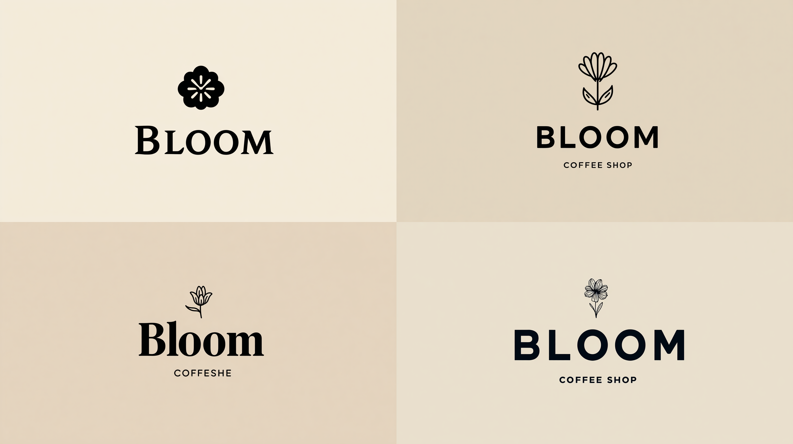

# Text & Typography Prompts / 文字与排版提示词

> Prompts featuring text rendering, typography, posters, and moodboards for Midjourney V7. V7 text rendering is improved but still imperfect — keep text short (2-4 words).

---

## Event Posters

### Prompt 1: Jazz Night Poster
**Parameters:** --ar 2:3 --v 7
**Prompt:**
```
A digital poster for a jazz night event with the words "Smooth Sounds Tonight" in glowing letters, moody lighting, neon aesthetic, dark background
```
**Best for:** Event promotion, poster design, nightlife branding
**Tips:** Keep text to 2-4 words max. V7 handles short phrases reasonably well but longer text will distort.


---

### Prompt 2: Minimalist Brand Logo
**Parameters:** --ar 1:1 --style raw --v 7
**Prompt:**
```
Minimalist logo design for a coffee shop called "Bloom", clean sans-serif typography, single line art flower icon, black on cream background, modern brand identity
```
**Best for:** Logo concepts, brand identity mockups, startup pitches
**Tips:** Use `--style raw` for more literal text rendering. "Sans-serif" helps keep letters cleaner.




---

## Moodboards & Layouts

### Prompt 3: Interior Design Moodboard
**Parameters:** --ar 16:9 --v 7
**Prompt:**
```
Interior design moodboard for a modern Scandinavian living room, neutral tones, natural materials, clean lines, cozy textures, calm palette
```
**Best for:** Interior design proposals, brand moodboards, client presentations
**Tips:** Moodboard-style prompts work well because V7 understands the collage/layout concept.


---

### Prompt 4: Fashion Brand Lookbook
**Parameters:** --ar 4:5 --s 300 --v 7
**Prompt:**
```
Fashion brand lookbook layout page, featuring a model in oversized cream linen outfit, polaroid-style photo arrangement, handwritten notes aesthetic, editorial layout, minimal design
```
**Best for:** Fashion brands, lookbook concepts, editorial layouts
**Tips:** "Polaroid-style" and "handwritten notes" create the scrapbook/lookbook feel without requiring precise text.


---

## Typography Art

### Prompt 5: Neon Sign Typography
**Parameters:** --ar 16:9 --s 400 --v 7
**Prompt:**
```
Neon sign reading "DREAM BIG" mounted on a dark brick wall, warm glow reflecting on wet pavement below, atmospheric, urban photography style
```
**Best for:** Motivational content, social media posts, urban aesthetic
**Tips:** Neon text renders more reliably than printed text because the glow masks imperfections.


---

### Prompt 6: Four Seasons Comparison
**Parameters:** --ar 16:9 --style raw --v 7
**Prompt:**
```
The same modern cabin with a cantilevered roof, shown in four seasonal variations: spring blossoms, summer lush greenery, autumn foliage, and winter snow. Consistent camera angle, photorealistic, documenting the changing environment
```
**Best for:** Client presentations, seasonal marketing, design comparison
**Tips:** "Consistent camera angle" helps V7 maintain the same perspective across all four panels. Use `--style raw` for more accurate architectural rendering.


---

## Text Rendering Tips for V7

| Technique | Effect |
|-----------|--------|
| Keep text to 2-4 words | More reliable rendering |
| Use `--style raw` | More literal text output |
| Use quotes around text | Helps V7 identify text to render |
| Neon/light effects | Glow masks text imperfections |
| Large, bold fonts | Render more cleanly than small text |
| Avoid handwritten style | V7 struggles with cursive scripts |

---

## More Resources

- [V7 New Features Guide](../guide/v7-new-features.md) — Improved text understanding in V7
- [Template: Portrait & Poster](../templates/portrait-template.md) — Adapt for text/poster design
